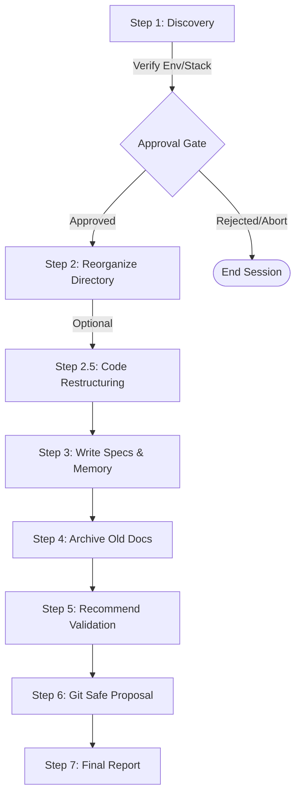

# 🛡️ Sentinel Agent Memory Bank

<p align="center">
  
  
  
  
</p>

---

## 🌟 Overview

**Sentinel** is a universal system prompt, workspace customization directive, and context management framework designed for autonomous AI coding agents (such as **Claude Code**, **Cursor Composer**, **Windsurf Cascade**, and **Google Antigravity**).

It establishes a structured, self-healing **Project Memory Bank** in any repository, ensuring that AI agents remain coherent, secure, and aligned with your historical engineering decisions—regardless of the programming language or project layout.

> [!IMPORTANT]
> **Why Sentinel?**
> - **Memory Bank Coherence:** Prevents AI "amnesia" between chats by reading and updating standard context files.
> - **Zero Code Damage:** Imposes strict guardrails prohibiting the AI from editing source code during analysis.
> - **Ecosystem Adaptation:** Auto-detects target stacks (WordPress, Flutter, C++, Rust, Next.js, Android, etc.) and adjusts testing/validation commands dynamically.
> - **Secure & Modern Default:** Forces the AI to use modern/stable dependency versions and apply security functions (like `esc_url()`) from line one.

---

## 🗺️ System Architecture

Sentinel organizes your repository's meta-context into four primary operational directories. None of these folders touch your application's source code.

```
📁 [Your Repository]
├── 📁 .memory-bank/        # Core context, session states, and historical logs
│   ├── active-session.json # Runtime state of the active session
│   ├── system-coherence.md # Automated verification checklist
│   ├── migration-map.md    # Tracks old files archived or reorganized
│   ├── adr/                # Architecture Decision Records (ADRs)
│   ├── changelog/          # Change logs and verified worklogs
│   └── state-of-the-union.md # Distilled context onboarding summary
├── 📁 .specs/              # Project technical specifications
│   ├── bootstrap.md        # Setup, installation, and build commands
│   ├── boundary-conditions.md # Technical limitations and safety budgets
│   ├── constitution.md     # Code quality and development standards
│   └── preflight-checklist.md # Persistent release & operator checklist
├── 📁 .agents/             # AI agent runtime customizations
│   ├── AGENTS.md           # Project-scoped AI behavior and rules (No Fluff)
│   └── runtime-manifest.json # Runtime configuration and permission boundaries
└── 📁 .tasks/              # Active task management
    ├── pipeline.md         # Active and future roadmap backlog
    └── handoff.md          # Multi-agent/session transition logs
```

For more details on directories, see [docs/architecture.md](file:///docs/architecture.md).

---

## 🔄 The 7-Step Lifecycle

Sentinel executes in a highly controlled, step-by-step cycle:



Read more about how these phases run in [docs/workflow.md](file:///docs/workflow.md).

---

## 🚀 Installation & Usage

### 🟢 Zero Setup — Let Your Agent Install It (For Beginners)

You don't need to understand what a \"skill folder\" or a \"terminal\" is. Just copy the text below for your AI agent and paste it into a new chat. The agent will handle the entire setup.

**For Claude Code:**
> Install sentinel skills: run `git clone --depth 1 https://github.com/BigDesigner/sentinel-agent-skill.git ~/sentinel-agent-skill && chmod +x ~/sentinel-agent-skill/install.sh && ~/sentinel-agent-skill/install.sh` then tell me what slash commands are now available.

**For Google Antigravity (Windows):**
> Install sentinel skills: run `git clone --depth 1 https://github.com/BigDesigner/sentinel-agent-skill.git "$env:USERPROFILE\.gemini\config\plugins\sentinel-agent-skill"` then tell me what slash commands are now available.

**For Cursor or Windsurf:**
> Since Cursor and Windsurf do not currently support native skill execution, open the `templates/sentinel-directive.md` file from this repo, copy all of its text, and paste it into your IDE's global rules (e.g., Settings → Rules for AI). Then simply type `/sentinel` in a new chat to begin.

---

### 🛠️ Advanced / Manual Installation

For power users who prefer to install the skills manually:

- **For Google Antigravity (Windows):** Clone directly to `%USERPROFILE%\.gemini\config\plugins\sentinel-agent-skill\`.
- **For Claude Code:** Clone the repository anywhere, then run the installer script:
  - macOS/Linux: `./install.sh`
  - Windows: `.\install.ps1`
  This will link individual skills under `skills/*` into `~/.claude/skills/` so they are recognized natively.

---

### ⚡ Available Skills

Once installed, you can trigger specific workflows using the following commands:
| Command | Purpose |
|---|---|
| **`/sentinel`** | Full 7-step bootstrap (Analyzes codebase, reorganizes folders, writes specs). |
| **`/sentinel-mb`** | Initializes or syncs only the `.memory-bank/` structure and active session state. |
| **`/sentinel-grill`** | Interrogates the user in an empty directory to architect the tech stack, then bootstraps a custom-tailored Memory Bank. |
| **`/sentinel-scan`** | Scans the repository for all `*.md` and `*.txt` files and outputs a categorized documentation inventory. |
| **`/sentinel-audit`** | Scans source files for common vulnerabilities (SQLi, XSS, RCE, IDOR, etc.) and security contract violations. Report-only. |
| **`/sentinel-handoff`**| Wraps up a work session. Syncs `active-session.json` and updates `handoff.md` with only codebase changes. Commit/push is proposed, never automatic. |
| **`/sentinel-planaudit`** | Acts as a Senior Architect. Auto-reviews and hardens implementation plans against project specs before execution. |
| **`/sentinel-clarify`** | Interrogates the user to resolve underspecified requirements and potential boundary violations before planning or coding begins. |
| **`/sentinel-drift`** | Detects discrepancies between the established architecture and the actual implementation (e.g. rogue packages, orphaned files). |
| **`/sentinel-converge`** | Compares the implemented codebase against the implementation plan to autonomously append missing or unfinished tasks. |
| **`/sentinel-qa`** | Autonomously writes Red Team unit and integration tests designed to aggressively break the boundary conditions and security rules. |
| **`/sentinel-preflight`** | Audits the deployment environment, external dependencies, CI/CD pipelines, and secrets before allowing a commit or release. |
| **`/sentinel-rescue`** | Hard-resets the project and memory bank back to the last known coherent state in case of severe hallucinations or corruption. |
| **`/sentinel-brief`** | Generates a single-page onboarding summary (State of the Union) for humans or agents migrating between environments. |
| **`/sentinel-prune`** | Safely cleans up bloated dependency/build folders (node_modules, .venv, target) and optimizes package managers (pnpm, uv). |
| **`/sentinel-doctor`** | Runs a deterministic integrity check on the memory bank (schema, stale locks, log rotation, archive consistency) and offers guided repairs. |
| **`/sentinel-coauth`** | Injects a rule prohibiting agents from appending "Co-Authored-By" trailers to commits or code blocks. |
| **`/sentinel-help`** | Displays a comprehensive help menu and command catalog in the user's preferred language, highlighting safety classifications. |

---

### ⏯️ Session Resume vs Re-initialization

By default, if you run `/sentinel` in a project that already has a `.memory-bank/active-session.json` file, Sentinel will perform a **Session Resume**. It will silently update the active session lock and proceed directly to your current task without asking for discovery approvals again.

If you want to force Sentinel to forget the current session state and run the full discovery and approval process from scratch, you must instruct the agent to **re-initialize**.
You can do this by saying:
> *"/sentinel please run a full re-initialization and ignore the existing session."*

---

### 🔄 How to Update

Since Sentinel is installed via Git, updates are fast and easy. 

**Zero Setup Method (For Beginners):**
Just tell your agent to update the repository for you:
> "Update my sentinel skills by running `git pull` inside the `sentinel-agent-skill` directory."

**Manual Method (For Power Users):**
Navigate to your agent's config folder where you installed Sentinel and pull the latest changes:
```bash
cd <path-to-skill-folder>/sentinel-agent-skill
git pull origin main
```

---

### 3. As a One-Time Bootstrapper
If you just want to organize a messy, flat project:
1. Copy the contents of [templates/sentinel-directive.md](file:///templates/sentinel-directive.md).
2. Paste it directly into your chat with Claude Code, ChatGPT, or Gemini.
3. Type *"Boot/Migrate this project"* and watch it scan, organize, and prepare validation/security specifications.

---

## 🛡️ Enterprise Security Architecture

Sentinel enforces strict operational boundaries to ensure autonomous agents run safely, predictably, and securely in long-running projects:

*   **Prompt Injection Shield:** Sentinel's primary read directives explicitly classify untrusted documentation and arbitrary markdown files as raw data, completely neutralizing malicious "jailbreak" or prompt injection attacks designed to override agent goals.
*   **Atomic State Management:** Multi-agent race conditions are prevented using strict OS-level locks (`.session.lock`) and atomic `.tmp.json` file writes when modifying the active session state.
*   **Context Window Protection:** To prevent "attention drop" and infinite token scaling, Sentinel automatically performs Log Rotation on continuous files (like `handoff.md` and `verified-worklog.md`). If files exceed 300 lines or 10 entries, old context is archived.
*   **Sandbox Violation Prevention:** Auditing skills restrict filesystem lookups exclusively to the local workspace, avoiding crashes or sandbox escape attempts in restricted Docker or Cloud IDE environments.

---

## 💬 AI Communication Standards (No Fluff)

Sentinel configures your workspace to enforce clean, direct agent interactions via `.agents/AGENTS.md`. When initialized, agents are bound by the following communication constraints:

*   **No Fluff:** The agent completely omits introductory greetings, congratulations, and politeness filler.
*   **Direct Focus:** Focuses immediately on production-ready code, clean commands, and raw audits.
*   **Error Acknowledgment:** When correcting an error, the agent will never apologize. It acknowledges the error and outputs the corrected replacement immediately.

---

## 📄 License

This project is licensed under the MIT License - see the [LICENSE](file:///LICENSE) file for details.

---

<p align="center">
  Made with 🛡️ for autonomous AI agents. Contributions and issues are welcome!
</p>

<p align="center">
  <a href="https://info.flagcounter.com/4IyX"></a>
</p>
