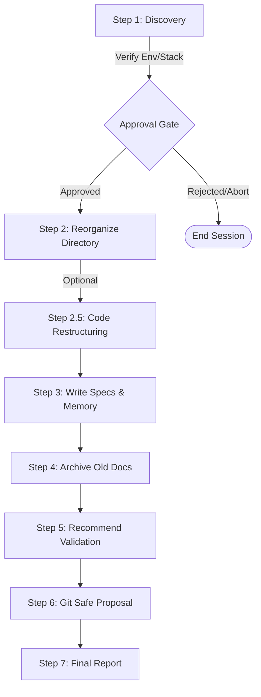

# Sentinel Execution Workflow

This document explains how Sentinel manages execution states, handles user approvals, restructures directories safely, and runs validation gates.

---

## 🔄 The 7-Step Lifecycle

Sentinel executes in a highly controlled, step-by-step cycle:

---

## 🛠️ Step 1.8: Discovery Approval Gate
Before Sentinel creates or modifies any files in the workspace:
1. It stops and reports the environment, stack, existing docs, and deployment workflows.
2. It waits for the user to type `Yes` or approve the plan.
3. It **never** writes files in Step 1 (read-only discovery phase).

---

## 📂 Step 2.5: Code Restructuring (Optional)
If a project is flat (e.g., > 10 source files directly in the root) or requires reorganization:
1. Sentinel evaluates the paradigm conventions (e.g. `backend/frontend` for web, `inc/assets` for WordPress).
2. It generates a **Move & Import Map** detailing every file move and path update required.
3. It presents the map to the user.
4. **Nothing moves until explicit approval.**
5. Once approved, files are moved, references updated, and builds/tests verified.

---

## 🤖 Interactive vs. CI Mode

Sentinel dynamically adapts based on the presence of the `CI=true` environment variable.

| Feature | Interactive Mode | CI Mode (`CI=true`) |
|---|---|---|
| **Approval Gates** | Pauses and blocks until user approves. | Skips approval gates, logs progress, and continues. |
| **Dirty Worktree** | Stops immediately, requests stash/commit. | Logs warning in `bug-list.md` and continues. |
| **Commit Proposal** | Prepares `git add` list and commit message. | Skips git operations; writes summary to `ci-run-summary.md`. |
| **Application Code Changes** | Allowed (requires explicit user consent). | **Strictly Forbidden.** |
| **GitHub actions summary** | Not generated. | Outputs Markdown report to `$GITHUB_STEP_SUMMARY`. |
